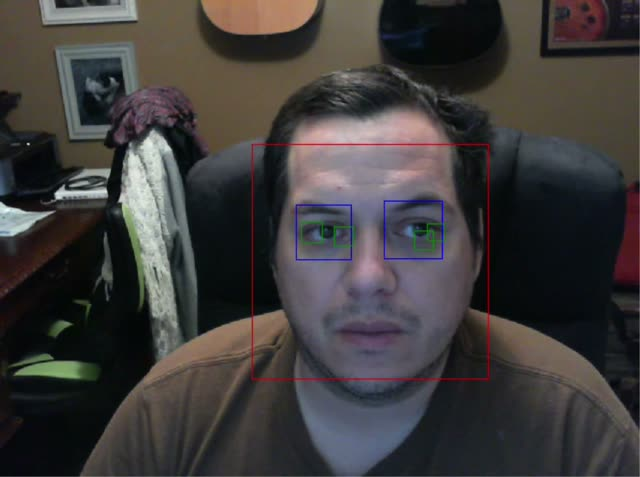
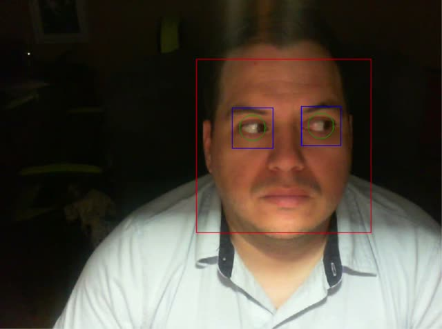

# COT 4900 — Facial Recognition for HCI

**Course:** COT 4900 — Facial Recognition for HCI  
**Term:** Fall 2017  
**School:** Florida Atlantic University (FAU)  
**Author:** John Hernandez

Windows / mobile prototypes that use a webcam (or device camera) plus OpenCV / Google Vision for face and eye tracking in HCI experiments.

## Historical screenshots (Fall 2017)

Stills from original **Eye Tracker Form** session recordings. Overlays: face (red), eyes (blue), iris (green).

**3 October 2017**

**7 November 2017**

## Layout

| Path | Description |
|------|-------------|
| `EyeTracker.sln` | Full solution (opens projects under `src/`) |
| `src/EyeTracker/` | WinForms eye tracker (`EyeTrackerOnWindows`) |
| `src/MobileEyeTracker/` | Xamarin / OpenCV Android eye tracker |
| `src/EyeTrackWithGoogleVision/` | Android Google Vision face tracker |
| `src/OpenCV.Binding/` | **Third-party support** — OpenCV Android binding (see `THIRD_PARTY.md`) |
| `Captures/` | Session videos, session logs, and related media |
| `submitted/orginal export submited/` | Original multipart `EyeTrackerTests.7z` submission archive |

## Third-party support

- `src/OpenCV.Binding/` — vendor OpenCV binding used by `MobileEyeTracker` only; not authored coursework. Details: [`src/OpenCV.Binding/THIRD_PARTY.md`](src/OpenCV.Binding/THIRD_PARTY.md).
- Emgu.CV on Windows may be under LGPL; see `src/EyeTracker/License-LGPL.txt` where present.

## Stack (as archived)

- C# / **.NET Framework 4.8.1** (Windows Forms Emgu.CV app)
- Xamarin.Android + OpenCV / Google Vision (mobile projects)
- Haar cascades for face and eye detection

## Build

1. Install the [.NET Framework 4.8.1 Developer Pack](https://dotnet.microsoft.com/download/dotnet-framework/net481) (Windows).
2. Open `EyeTracker.sln` in Visual Studio (Android workload optional for mobile projects).
3. Restore NuGet packages into the repo-root `packages/` folder.
4. Build/run `EyeTrackerOnWindows` with a webcam for the desktop prototype.
